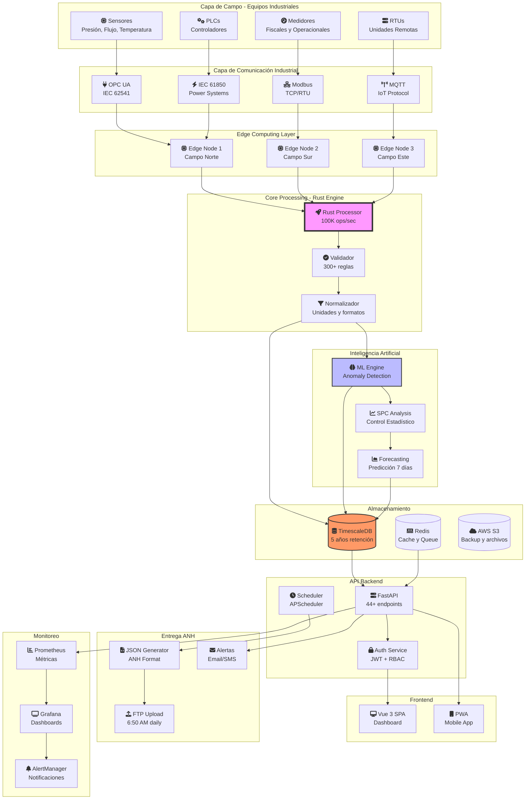
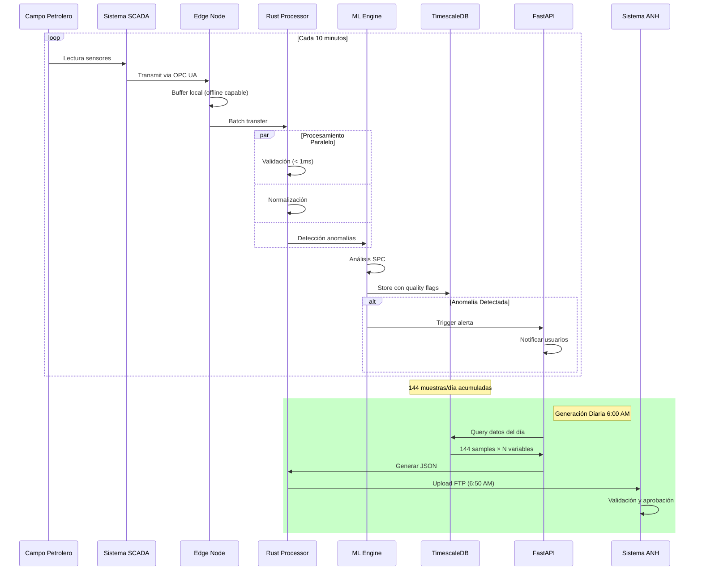
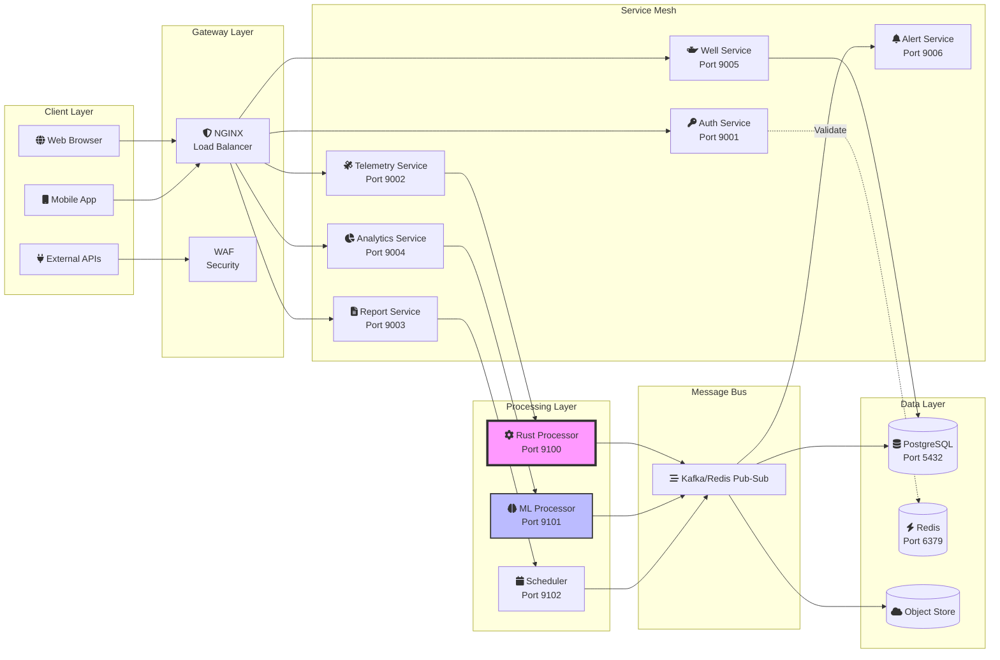
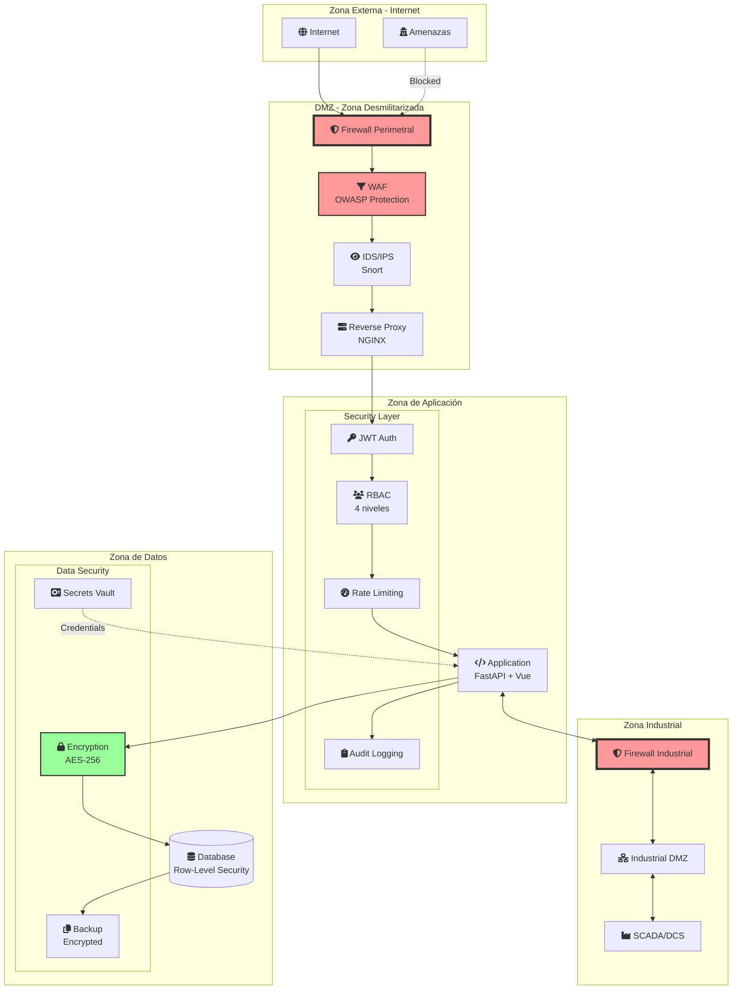
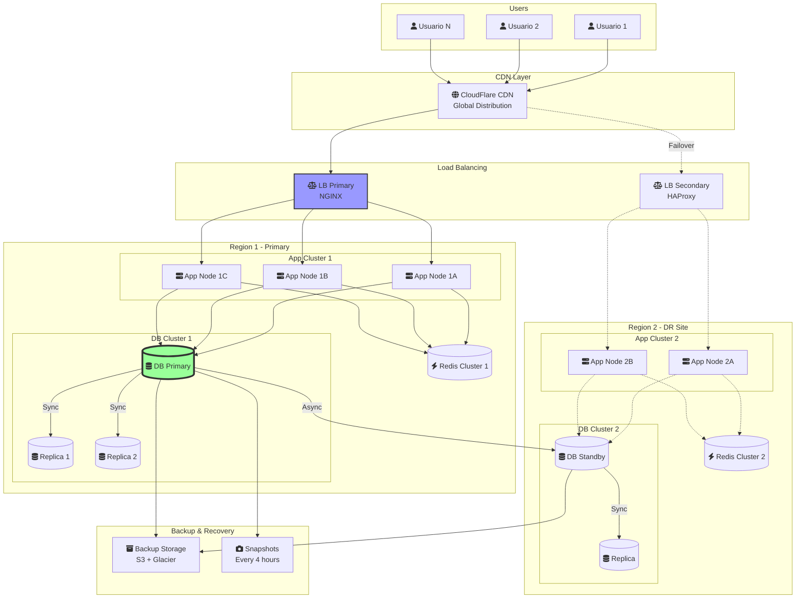
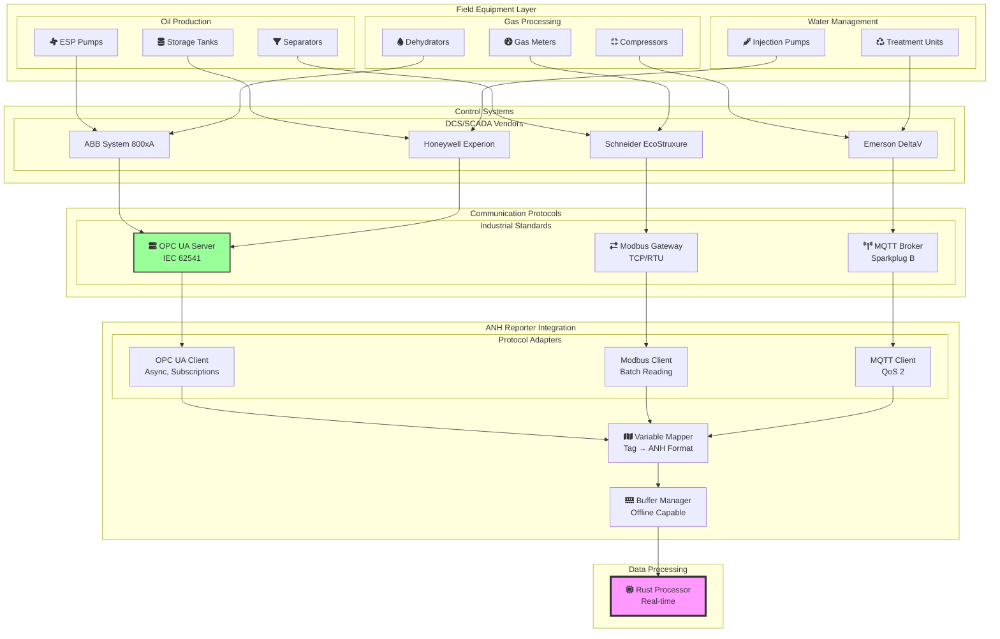
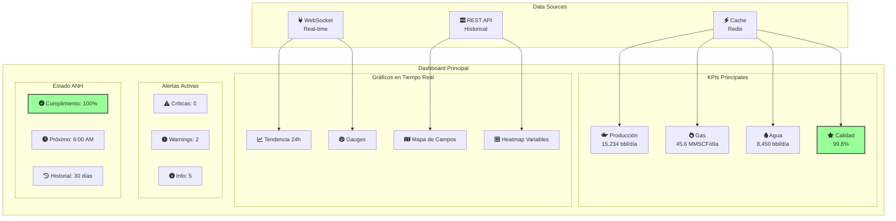
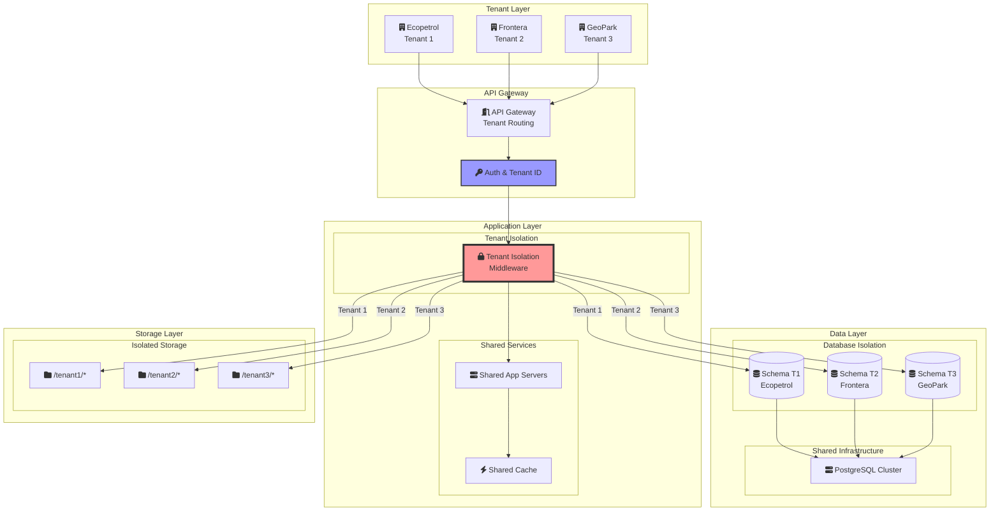

```mermaid
graph LR
    subgraph "Data Ingestion"
        RAW[fa:fa-database Raw Data<br/>100K points/sec]
        CLEAN[fa:fa-filter Data Cleaning<br/>Outlier removal]
        FEATURE[fa:fa-cogs Feature Engineering<br/>79 variables]
    end

    subgraph "Model Training"
        SPLIT[fa:fa-cut Train/Test Split<br/>80/20]
        TRAIN[fa:fa-graduation-cap Training<br/>Isolation Forest]
        VALIDATE[fa:fa-check Validation<br/>Cross-validation]
        TUNE[fa:fa-sliders-h Hyperparameter<br/>Tuning]
    end

    subgraph "Model Deployment"
        SERIALIZE[fa:fa-save Model Export<br/>Pickle/ONNX]
        DEPLOY[fa:fa-rocket Deploy<br/>Production]
        MONITOR[fa:fa-chart-line Monitor<br/>Performance]
    end

    subgraph "Inference Pipeline"
        STREAM[fa:fa-stream Real-time Stream]
        PREDICT[fa:fa-magic Prediction<br/>< 10ms latency]
        ACTION[fa:fa-bolt Action<br/>Alert/Report]
    end

    subgraph "Feedback Loop"
        FEEDBACK[fa:fa-sync Feedback<br/>From operators]
        RETRAIN[fa:fa-redo Retrain<br/>Monthly]
        VERSION[fa:fa-code-branch Versioning<br/>MLflow]
    end

    RAW --> CLEAN
    CLEAN --> FEATURE
    FEATURE --> SPLIT

    SPLIT --> TRAIN
    TRAIN --> VALIDATE
    VALIDATE --> TUNE
    TUNE --> SERIALIZE

    SERIALIZE --> DEPLOY
    DEPLOY --> MONITOR

    STREAM --> PREDICT
    PREDICT --> ACTION

    ACTION --> FEEDBACK
    FEEDBACK --> RETRAIN
    RETRAIN --> VERSION
    VERSION --> DEPLOY

    style PREDICT fill:#bbf,stroke:#333,stroke-width:4px
    style TRAIN fill:#f9f,stroke:#333,stroke-width:2px
```

# 🎨 Diagramas de Arquitectura - ANH Smart Reporter

## 📊 Arquitectura General del Sistema

## 🔄 Flujo de Procesamiento de Datos

## 🏗️ Arquitectura de Microservicios

## 🔐 Arquitectura de Seguridad

## 📈 Pipeline de Machine Learning

## 🌐 Arquitectura de Alta Disponibilidad

## 🔌 Integración SCADA/OPC UA

## 📊 Dashboard de Monitoreo en Tiempo Real

## 🔄 CI/CD Pipeline

```mermaid
graph LR
    subgraph "Development"
        DEV[fa:fa-code Developer<br/>Local Env]
        GIT[fa:fa-code-branch Git Push<br/>Feature Branch]
    end

    subgraph "CI Pipeline"
        subgraph "Build Stage"
            LINT[fa:fa-check Linting<br/>ESLint, Black]
            BUILD[fa:fa-hammer Build<br/>Docker Images]
            TEST[fa:fa-vial Tests<br/>Unit + Integration]
        end

        subgraph "Security Stage"
            SAST[fa:fa-shield-alt SAST<br/>Semgrep]
            DEPS[fa:fa-lock Dependency<br/>Check]
            SCAN[fa:fa-search Container<br/>Scan]
        end
    end

    subgraph "CD Pipeline"
        subgraph "Staging"
            DEPLOY_STG[fa:fa-rocket Deploy<br/>Staging]
            E2E[fa:fa-robot E2E Tests<br/>Cypress]
            PERF[fa:fa-tachometer-alt Performance<br/>Tests]
        end

        subgraph "Production"
            APPROVE[fa:fa-user-check Manual<br/>Approval]
            DEPLOY_PROD[fa:fa-rocket Deploy<br/>Production]
            MONITOR[fa:fa-chart-line Monitor<br/>Metrics]
        end
    end

    subgraph "Feedback"
        ALERT[fa:fa-bell Alerts]
        ROLLBACK[fa:fa-undo Rollback<br/>if needed]
    end

    DEV --> GIT
    GIT --> LINT
    LINT --> BUILD
    BUILD --> TEST

    TEST --> SAST
    SAST --> DEPS
    DEPS --> SCAN

    SCAN --> DEPLOY_STG
    DEPLOY_STG --> E2E
    E2E --> PERF

    PERF --> APPROVE
    APPROVE --> DEPLOY_PROD
    DEPLOY_PROD --> MONITOR

    MONITOR --> ALERT
    ALERT -.->|Issues| ROLLBACK
    ROLLBACK -.-> DEPLOY_PROD

    style TEST fill:#9f9,stroke:#333,stroke-width:2px
    style DEPLOY_PROD fill:#f9f,stroke:#333,stroke-width:4px
```

## 🌍 Arquitectura Multi-Tenant

---

## 📐 Resumen de Componentes Técnicos

### Tecnologías Core

| Componente | Tecnología | Versión | Función |
|------------|------------|---------|----------|
| **Backend** | FastAPI | 0.104+ | REST API |
| **Processing** | Rust | 1.75+ | High-performance |
| **Frontend** | Vue.js | 3.3+ | SPA Dashboard |
| **Database** | PostgreSQL | 15+ | Data persistence |
| **Time Series** | TimescaleDB | 2.13+ | Telemetry storage |
| **Cache** | Redis | 7+ | In-memory cache |
| **ML Framework** | scikit-learn | 1.3+ | Anomaly detection |
| **Container** | Docker | 24+ | Containerization |
| **Orchestration** | Docker Compose | 2.23+ | Local deployment |
| **Monitoring** | Prometheus | 2.47+ | Metrics collection |
| **Visualization** | Grafana | 10.2+ | Dashboards |

### Protocolos Industriales Soportados

| Protocolo | Estándar | Uso |
|-----------|----------|-----|
| **OPC UA** | IEC 62541 | SCADA moderno |
| **Modbus** | TCP/RTU | PLCs legacy |
| **MQTT** | v5.0 | IoT devices |
| **IEC 61850** | Ed 2.0 | Power systems |
| **DNP3** | IEEE 1815 | Telemetría remota |
| **IEC 60870-5-104** | IEC 60870 | Utilities |

### Métricas de Performance

| Métrica | Valor | Condición |
|---------|-------|-----------|
| **Throughput** | 100K msgs/sec | Peak load |
| **Latency** | < 1ms | P99 |
| **Availability** | 99.95% | Annual |
| **RPO** | 15 min | Recovery Point |
| **RTO** | 1 hour | Recovery Time |
| **MTBF** | 2500 hours | Reliability |
| **MTTR** | < 30 min | Maintainability |

---

*Documentación visual actualizada: Noviembre 2025 | v3.0.0*