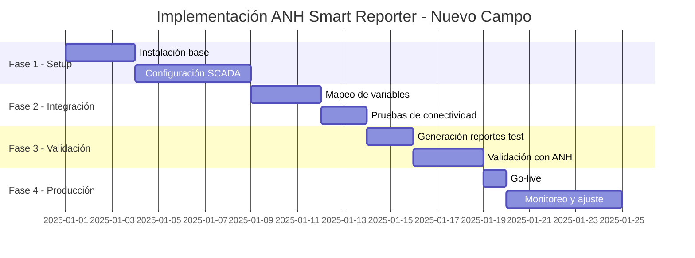

# 📋 Escenarios de Aplicación - ANH Smart Reporter

## 🎯 Casos de Uso Típicos de la Industria

### 🛢️ Escenario 1: Campo de Producción Terrestre

**Contexto Típico:**
- 20-100 pozos activos
- Sistema SCADA existente
- Reportes manuales diarios
- Personal limitado para reportes

**Solución ANH Smart Reporter:**
```yaml
Capacidades_Aplicadas:
  - Integración automática con SCADA via OPC UA/Modbus
  - Recolección cada 10 minutos (144 muestras/día)
  - Generación automática de reportes JSON
  - Upload FTP sin intervención manual
  - Detección de anomalías en tiempo real
```

**Beneficios Esperados:**
- Eliminación de tareas manuales repetitivas
- Cumplimiento garantizado con ANH
- Detección temprana de problemas operacionales
- Liberación de personal para tareas de mayor valor

---

### ⚓ Escenario 2: Operación Offshore

**Contexto Típico:**
- Plataformas marinas con acceso limitado
- Conectividad satelital costosa
- Requisitos críticos de seguridad
- Ventanas de mantenimiento reducidas

**Arquitectura Recomendada:**
```python
configuracion_offshore = {
    "edge_computing": {
        "procesamiento_local": True,
        "buffer_dias": 7,
        "compresion": "Habilitada",
        "sincronizacion": "Inteligente"
    },
    "redundancia": {
        "nodo_primario": "Plataforma",
        "nodo_secundario": "Onshore",
        "failover_automatico": True
    },
    "seguridad": {
        "encriptacion": "AES-256",
        "certificados": "IEC 62443",
        "audit_trail": "Inmutable"
    }
}
```

**Ventajas de la Solución:**
- Operación autónoma durante desconexiones
- Optimización del ancho de banda satelital
- Cumplimiento con estándares de seguridad offshore
- Alta disponibilidad (99.95%+)

---

### 🌄 Escenario 3: Campos Remotos con Conectividad Limitada

**Desafíos Comunes:**
- Múltiples campos distribuidos geográficamente
- Conectividad intermitente (radio, celular)
- Diferentes sistemas de automatización
- Logística compleja para mantenimiento

**Implementación Edge Computing:**
```javascript
const edgeDeployment = {
  nodos_edge: [
    {
      ubicacion: "Campo_Norte",
      pozos: 25,
      conectividad: "4G_LTE",
      procesamiento_local: true,
      cache_dias: 3
    },
    {
      ubicacion: "Campo_Sur",
      pozos: 30,
      conectividad: "Radio_900MHz",
      procesamiento_local: true,
      cache_dias: 7
    }
  ],

  sincronizacion: {
    modo: "Oportunista",
    compresion: true,
    prioridad: "Datos_ANH",
    retry_policy: "Exponential_backoff"
  }
};
```

**Resultados Esperables:**
- Continuidad operacional sin conectividad permanente
- Reducción en costos de telecomunicaciones
- Procesamiento y validación en sitio
- Sincronización inteligente cuando hay conectividad

---

### 🏭 Escenario 4: Integración Multi-SCADA

**Situación Típica:**
- Diferentes marcas de SCADA por campo/área
- Protocolos de comunicación heterogéneos
- Formatos de datos inconsistentes
- Necesidad de vista unificada

**Solución de Integración:**
```yaml
Middleware_Unificado:
  Conectores:
    - ABB_800xA: OPC_Classic
    - Schneider_EcoStruxure: OPC_UA
    - Honeywell_Experion: Modbus_TCP
    - Emerson_DeltaV: MQTT

  Normalización:
    - Mapeo_automático_variables
    - Conversión_unidades
    - Sincronización_temporal
    - Validación_cruzada

  Salida:
    - Dashboard_unificado
    - Reporte_ANH_consolidado
    - APIs_para_sistemas_corporativos
```

**Beneficios de Unificación:**
- Vista única de todas las operaciones
- Reportes consolidados automáticos
- Análisis cross-field para optimización
- Reducción de complejidad operativa

---

### 📊 Escenario 5: Optimización de Campos Maduros

**Características:**
- Pozos con declinación de producción
- Datos históricos extensos disponibles
- Necesidad de maximizar recuperación
- Presupuesto limitado para nuevas inversiones

**Aplicación de Machine Learning:**
```python
class OptimizacionCampoMaduro:
    def __init__(self):
        self.modelos = {
            "prediccion_declinacion": DeclineModel(),
            "optimizacion_levantamiento": LiftOptimizer(),
            "deteccion_problemas": AnomalyDetector()
        }

    def analizar_pozo(self, pozo_id):
        # Análisis basado en históricos
        return {
            "declinacion_esperada": "2.5% mensual",
            "accion_recomendada": "Ajustar frecuencia bombeo",
            "problema_detectado": "Posible taponamiento",
            "prioridad_intervencion": "Media",
            "mejora_esperada": "1.5% producción"
        }

    def optimizar_campo(self):
        # Optimización global del campo
        return {
            "pozos_prioritarios": [1, 5, 12],
            "acciones_inmediatas": 3,
            "potencial_mejora": "3-5% producción total"
        }
```

**Valor Agregado:**
- Maximización de producción con recursos existentes
- Priorización inteligente de intervenciones
- Detección temprana de problemas
- Extensión de vida útil del campo

---

### 🚀 Escenario 6: Arranque de Nuevo Campo

**Requerimientos:**
- Implementación rápida
- Escalabilidad para crecimiento
- Integración con sistemas corporativos
- Cumplimiento desde día 1

**Plan de Implementación por Fases:**



**Ventajas del Approach:**
- Tiempo mínimo a producción (< 1 mes)
- Crecimiento modular según necesidad
- Sin deuda técnica inicial
- Mejores prácticas desde el inicio

---

## 🔧 Configuraciones Recomendadas por Tamaño

### Operación Pequeña (< 50 pozos)
```yaml
Configuración:
  - Modelo: SaaS
  - Servidores: 1 nodo
  - Redundancia: Backup diario
  - Soporte: Remoto
  - Actualizaciones: Automáticas
```

### Operación Mediana (50-200 pozos)
```yaml
Configuración:
  - Modelo: Híbrido (Edge + Cloud)
  - Servidores: 2-3 nodos
  - Redundancia: Hot standby
  - Soporte: Remoto + visitas trimestrales
  - Actualizaciones: Programadas
```

### Operación Grande (200+ pozos)
```yaml
Configuración:
  - Modelo: On-premise
  - Servidores: Cluster distribuido
  - Redundancia: N+1 en todos los componentes
  - Soporte: On-site + remoto 24/7
  - Actualizaciones: Ventanas de mantenimiento
```

---

## 📈 Métricas de Éxito Esperadas

### KPIs Operacionales
- **Automatización**: 100% de reportes sin intervención
- **Disponibilidad**: > 99.95% uptime
- **Precisión**: > 99.8% calidad de datos
- **Cumplimiento**: 100% reportes a tiempo
- **Detección**: < 1 minuto para anomalías críticas

### Indicadores de Mejora
- **Eficiencia del personal**: 80%+ tiempo liberado para análisis
- **Reducción de errores**: > 95% menos errores manuales
- **Velocidad de respuesta**: 10x más rápido en detección de problemas
- **Optimización de producción**: 2-5% mejora típica
- **Cumplimiento normativo**: 100% sostenido

---

## 💡 Mejores Prácticas de Implementación

### ✅ Factores de Éxito
1. **Involucramiento temprano** del personal operativo
2. **Mapeo completo** de variables antes de go-live
3. **Pruebas exhaustivas** con datos históricos
4. **Capacitación continua** del personal
5. **Monitoreo proactivo** post-implementación

### ⚠️ Errores Comunes a Evitar
1. Subestimar la complejidad de integración SCADA
2. No involucrar a operadores en el diseño
3. Saltarse la fase de validación con ANH
4. Configuración inadecuada de alertas (demasiadas o pocas)
5. No planificar para crecimiento futuro

---

## 🎯 Conclusión

ANH Smart Reporter se adapta a cualquier escenario operacional en la industria petrolera colombiana, desde pequeños campos terrestres hasta complejas operaciones offshore. La clave del éxito está en:

- **Flexibilidad** de la arquitectura
- **Escalabilidad** comprobada
- **Compatibilidad** con sistemas existentes
- **Cumplimiento** garantizado con ANH
- **Soporte** continuo y especializado

Cada implementación se personaliza según las necesidades específicas del operador, garantizando el máximo valor desde el día 1.

---

*Documento de escenarios de aplicación - Noviembre 2025 | v3.0.0*